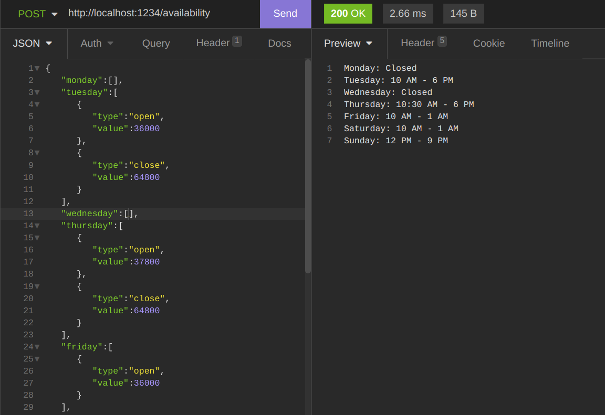
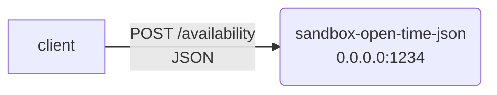

# sandbox-open-time-json

Opening Hours API. Takes JSON and returns human-readable result in 12h format.



## Installation & Usage

```sh
nvm use
npm i
npm run build
docker-compose up


curl -X POST -H "Content-Type: application/json" -d '{"monday": [{"type": "open", "value": 32400},{"type": "close","value": 37800}]}' http://localhost:1234/availability
```

### Thoughts on data format
*JSON* format seems ok if we're talking about data exchange format with current REST APIs.

Possible improvements could
- use *binary* ArrayBuffer where 1 second = 1 bit. This would mean that a week interval of 7*24*60*60 seconds as bits could be encoded as a 75.6 KB payload, which could be scanned in a single pass-through operation to generate human-readable format. This would be useful if we want process to use predictable (low) amount of fixed memory per request, because JSON solution with payload that has too many time intervals is not so performant.
- add more strictness with schema to ensure that keys match and that validation is simpler. For example GraphQL mutations could enforce input format, so that we don't need to manually check presense of open/close types. A [JSON schema range types](https://json-schema.org/understanding-json-schema/reference/numeric.html#range) could enforce min/max value...
- add more specific error handling API contract. Currently implemented REST API ignores invalid data structures, because customer is not clear. Because of that, architecture choice of simplicity and resiliency was done, over transparency with feedback. If for some reason we need to stop client with invalid input or notify him, we would either need to throw error or gather them into separate datastructure and have a way to notify him - 400 HTTP status + custom response. Current requirements do not allow custom error response, as its text-based. Optionally, we could pass fastify error logger to detect such cases and have alerting.

## Architecture




### Tech stack

- nodejs 16
- typescript
- fastify


## API
<details><summary><h3>🟡 POST /availability</h3></summary>

Convert open-hours for restoraunt availability from JSON to human-readable format.

##### Request params (raw body)

Input JSON consists of keys indicating days of a week and corresponding opening hours
as values. One JSON file includes data for one restaurant.

```
{
<dayofweek>: <opening hours>
<dayofweek>: <opening hours>
...
}
```

- <dayofweek>: monday / tuesday / wednesday / thursday / friday / saturday / sunday
- <opening hours>: an array of objects containing opening hours. Each object consist of
  two keys: - type: open or close - value: opening / closing time as UNIX time (1.1.1970 as a date), e.g. 32400 = 9 AM, 37800 = 10:30 AM, max value is 86399 = 11:59:59 PM

Example: on Mondays a restaurant is open from 9 AM to 8 PM

```json
{
"monday" : [
{
"type" : "open",
"value" : 32400
},
{
"type" : "close",
"value" : 72000
}
],
….
}
```
</details>


## Development

```
npm run dev
```

## Testing

```
npm run test:unit
npm run test:functional
```

# Requirements

## In short

Your task is to write an endpoint that accepts JSON-formatted opening hours of a
restaurant as an input and returns the rendered human readable format as a text output.


### Special cases

- If a restaurant is closed the whole day, an array of opening hours is empty.
  - “tuesday”: [] means a restaurant is closed on Tuesdays
- A restaurant can be opened and closed multiple times during the same day. E.g. on Mondays from 9 AM - 11 AM and from 1 PM to 5 PM
- A restaurant might not be closed during the same day - A restaurant can be opened e.g. on a Friday evening and closed early
  Saturday morning. In that case friday-object includes only the opening time.
  Closing time is part of the saturday-object. - When printing opening hours which span between multiple days, closing
  time is always a part of the day when a restaurant was opened (e.g. Friday 8
  PM - 1 AM)

```json
{
  "friday": [
    {
      "type": "open",
      "value": 64800
    }
  ],
  "saturday": [
    {
      "type": "close",
      "value": 3600
    },
    {
      "type": "open",
      "value": 32400
    },
    {
      "type": "close",
      "value": 39600
    },
    {
      "type": "open",
      "value": 57600
    },
    {
      "type": "close",
      "value": 82800
    }
  ]
}
```

A restaurant is open:

```
Friday: 6 PM - 1 AM
Saturday: 9 AM -11 AM, 4 PM - 11 PM
```

## Deliverable

### Part 1

Build a HTTP API that accepts opening hours data as an input (JSON) and returns a more
human readable version of the data formatted using a 12-hour clock.

Output example in 12-hour clock format:

```
Monday: 8 AM - 10 AM, 11 AM - 6 PM
Tuesday: Closed
Wednesday: 11 AM - 6 PM
Thursday: 11 AM - 6 PM
Friday: 11 AM - 9 PM
Saturday: 11 AM - 9 PM
Sunday: Closed
```

Return the formatted version in HTTP response.

### Part 2

Tell us what you think about the data format. Is the current JSON structure the best way
to represent that kind of data or can you come up with a better version? There are no
right answers here 🙂. Please write your thoughts to readme.md.

#### Sending the assignment

Bundle everything into a Zip archive and mail it to us. Remember that it is easier for us
to review your task if we can test & run it. Please don’t store your code in a public
repository.
A good check before sending your task is to unzip the Zip archive into a new folder and
check that building and running the project works, using the steps you define in
readme.md. Forgotten dependencies and instructions can sometimes happen even to the
best of us

#### A word about the expected quality

We consider this exercise as “a PR review”. Our developers will check the code, tests
and overall structure and prepare comments & questions they want to go through with
you during the interview.
Send us code you would be happy to review by yourself and discuss further.

#### A word about potential edge cases

If you’re unsure about the expected behavior in some edge cases, please take the best
approach you can think of and document your assumptions as part of the readme.

#### What else happens during the tech interview?

In addition to going through the homework assignment, we typically have a system
design exercise. The task is not about memorizing sorting algorithms, but instead figuring
out an MVP solution to something that could be built by one of the engineering teams in
Wolt. There are no right or wrong answers and the exercise is done with a very
discussion-oriented approach - the same way we work in Wolt.

## Technologies

Feel free to use any programming language you prefer (unless specifically asked to write
the program using e.g. Python or Kotlin). 3rd party libraries and frameworks are also
allowed.
Full JSON Example

Input

```json
{
  "monday": [],
  "tuesday": [
    {
      "type": "open",
      "value": 36000
    },
    {
      "type": "close",
      "value": 64800
    }
  ],
  "wednesday": [],
  "thursday": [
    {
      "type": "open",
      "value": 37800
    },
    {
      "type": "close",
      "value": 64800
    }
  ],
  "friday": [
    {
      "type": "open",
      "value": 36000
    }
  ],
  "saturday": [
    {
      "type": "close",
      "value": 3600
    },
    {
      "type": "open",
      "value": 36000
    }
  ],
  "sunday": [
    {
      "type": "close",
      "value": 3600
    },
    {
      "type": "open",
      "value": 43200
    },
    {
      "type": "close",
      "value": 75600
    }
  ]
}
```

Output

```
Monday: Closed
Tuesday: 10 AM - 6 PM
Wednesday: Closed
Thursday: 10:30 AM - 6 PM
Friday: 10 AM - 1 AM
Saturday: 10 AM - 1 AM
Sunday: 12 PM - 9 PM
```
