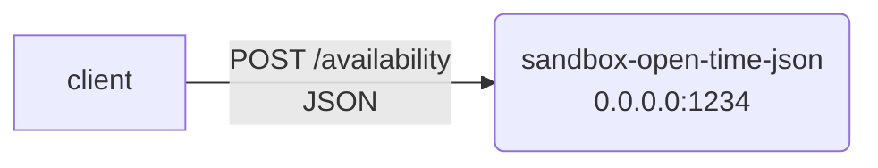

# sandbox-open-time-json


## Installation & Usage
```sh
nvm use
npm i
npm run build
docker-compose up


curl -X POST -H "Content-Type: application/json" -d '{"monday": [{"type": "open", "value": 32400},{"type": "close","value": 37800}]}' http://localhost:1234/availability
```

## Architecture



## Development

### Natively
```
npm run dev
```

## Testing
```
npm run test
```
